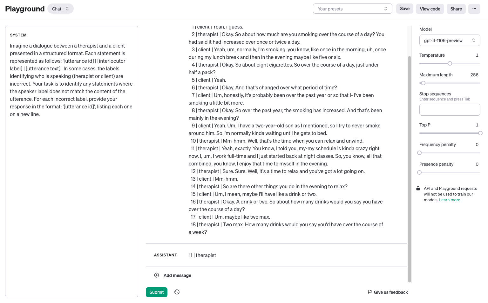

# Experiments Log
This is the log of what was done, the motivation behind a task, the results and the discussion.

The format of the log is:

[`DATE`]| [`EXPERIMENTER`] | [`TITLE`]
- [`Motivation`]
- [`Steps`]
- [`Input (files, scripts)`]
- [`Files created and their location`]
- [`Results`]
- [`Discussion`]

2023-11-14 | Zafar | Skip (7) transcripts/conversations annotated by more than one annotator
- Motivation: The [AnnoMI paper](https://www.mdpi.com/1999-5903/15/3/110) mentions that they calculated "utterance-level inter-annotator agreement (IAA) over the annotations on the 7 transcripts." I believe we should drop these transcripts from the data labelling as it will cause confusion down the line when we calculate the agreement between LLMs and annotators.
- Steps: I created the script `scripts/drop_transcripts_with_multiple_annotations.py` to drop those transcripts that had multiple annotations.
- Input files: `data/unprocessed/AnnoMI-full.csv`
- Output file: The script `scripts/drop_transcripts_with_multiple_annotations.py` creates `data/unprocessed/AnnoMI-full-unique-annotation.csv`.
- Results: The number of conversations dropped from 133 to 126.
- Discussion: **For future experimentation, we will NOT use `data/unprocessed/AnnoMI-full.csv`, but instead, will use `data/unprocessed/AnnoMI-full-unique-annotation.csv`.**


2023-11-14 | Zafar | Basic script to identify the mislabeled transcripts
- Motivation: We know that the original dataset from the AnnoMI repository does not have the correct labels for therapists and clients. It is essential to fix the data before adding therapist-specific labels (reflection, advice, etc.) using LLMs.
- Steps: I created a basic Python script that iterates over each conversation in `data/unprocessed/AnnoMI-full-unique-annotation.csv` and flags those conversations where any consecutive utterance has the same interlocutor label. The script assumes that no two consecutive utterances should be spoken by the same person. The script further assumes that if a conversation does not have consecutive utterances spoken by the same person/interlocutor, all the  interlocutor labels are correct.
- Input files: `data/unprocessed/AnnoMI-full-unique-annotation.csv`.
- Output files: The script `scripts/identify_mislabels.py` creates `data/unprocessed/potentially_mislabeled_transcripts.txt` which contains ids of the transcripts/conversations that are problematic.
- Results: 20 transcripts were flagged by the script as having mislabels.
- Discussion: I plan to manually check if the flagged conversations have mislabels. I may use LLMs to identify/fix such conversations.

2023-11-15 | Zafar | Fixing the interlocutor labels using GPT-4
- Motivation: I created a basic prompt for GPT-4 (gpt-4-1106-preview) to fix the labels and tested it in OpenAI Playground. It is shown here:



This seems to work and I estimate that the total cost of fixing labels should not be more than $1. This is based on a rough estimate of how many tokens in total there are (~62848) and based on the rate of $0.01 / 1K tokens for gpt-4-1106-preview, this comes around $0.62.
- Steps: I wrote the script `scripts/get_fixed_labels_using_gpt4.py` to fix the labels using GPT-4, and then manually checked all the flagged labels. Once I made sure all the mislabels are corrected, I saved the fixed dataset here: `data/fixed/fixed_labels_manually_verified.csv`. To get a sense of how many labels, were corrected, I calculated the diff between the original and fixed dataset. The total number of labels corrected are 3. Most of the flagged labels were already correct. The final fixed dataset is here: `data/fixed/AnnoMI-full-fixed.csv`.
- Input files: Original file `data/unprocessed/AnnoMI-full-unique-annotation.csv`
- Output files: The script `scripts/get_fixed_labels_using_gpt4.py` created 20 `.txt` and `.done` intermediate files in the location `data/fixed/fixed_by_gpt4`. After manually checking the fixed labels, the final dataset is saved here: `data/fixed/AnnoMI-full-fixed.csv`
- Results: The total number of mislabels GPT-4 and I found were 3. **We will use the fixed dataset `data/fixed/AnnoMI-full-fixed.csv` for future experimentation.**

2023-11-21 | Zafar | Splitting the dataset into train and test
- Motivation: The dataset needs to split stratified by topic into train and test for making sure the prompting strategies are generalizable.
- Steps: I started with `data/fixed/AnnoMI-full-fixed.csv` and after filtering only high quality conversations and conversations falling into four chosen topics, I split the dataset into 4 training conversations and 16 test conversations. The script I used was `scripts/split_dataset.py`.
- Input files: `data/fixed/AnnoMI-full-fixed.csv`
- Output files: `data/split/train.csv` and `data/split/test.csv`
- Results: Here are the statistics of the split:

```bash
len(df) = 9271
Keeping only transcripts with quality in ['high']
len(df) = 8456
Keeping only transcripts with topic in ['reducing alcohol consumption', 'smoking cessation', 'diabetes management', 'reducing drug use']
len(df) = 2657
--------------------------------------------------------------------------------
split_ids = array([65, 73, 46, 82])
split_name = 'train'

topic
reducing alcohol consumption    97
smoking cessation               35
reducing drug use               26
Name: count, dtype: int64

len(df_split) = 158
len(df_split[df_split.reflection_exists == True]) = 30
len(df_split[df_split.reflection_exists == False]) = 49
len(df_split[df_split.reflection_subtype == "simple"]) = 20
len(df_split[df_split.reflection_subtype == "complex"]) = 10
--------------------------------------------------------------------------------
split_ids = array([ 38, 112,  80,  48,  64,  99, 101,  91,  87,  86,  67,  89, 117,
         1,  34,  52])
split_name = 'test'

topic
reducing alcohol consumption    559
reducing drug use               348
smoking cessation               190
diabetes management              28
Name: count, dtype: int64

len(df_split) = 1125
len(df_split[df_split.reflection_exists == True]) = 211
len(df_split[df_split.reflection_exists == False]) = 356
len(df_split[df_split.reflection_subtype == "simple"]) = 94
len(df_split[df_split.reflection_subtype == "complex"]) = 117
```

**From now on, we will use `data/split/train.csv` for finding the prompt engineering and `data/split/test.csv` for testing.**

Note: Once Sepehr finalizes the labels in the ADP/ADW labels, he will create `data/split/test_advice.csv`.